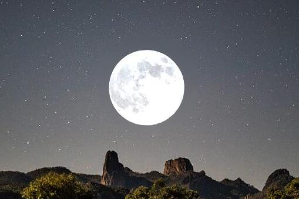
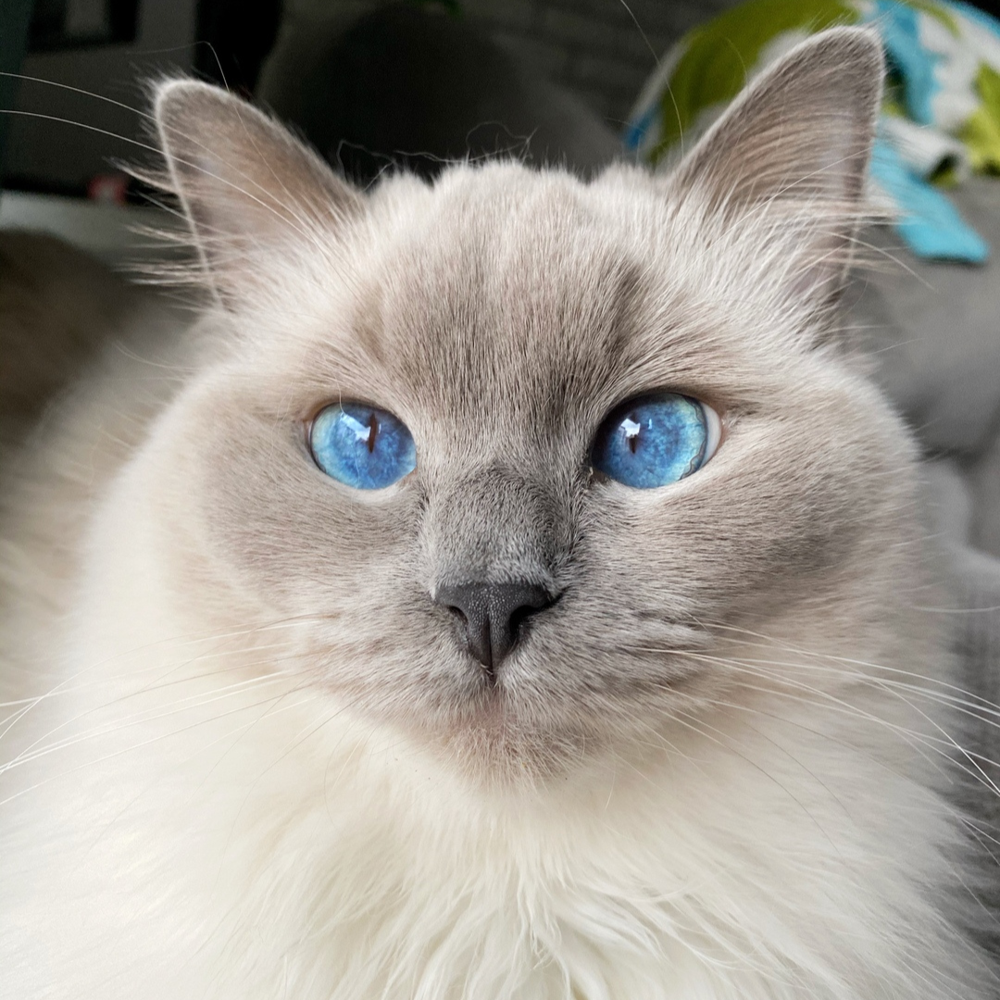

# Gradient-Domain Processing Project

This project explores the power and potential of gradient-domain processing - a sophisticated method for combining multiple images by recognizing and processing their gradients and edges to create a high-quality output image. Various techniques such as Poisson Blending, Mixed Gradients, Laplacian pyramid blending, Poisson Sharpening, Poisson Color Transfer, and Poisson Color2Gray were employed.

This project explores the power and potential of gradient-domain processing - a sophisticated method for combining multiple images by recognizing and processing their gradients and edges to create a high-quality output image. Various techniques such as Poisson Blending, Mixed Gradients, Laplacian pyramid blending, Poisson Sharpening, Poisson Color Transfer, and Poisson Color2Gray were employed.

A detailed analysis of the project can be found in the [report](https://github.com/OlaPietka/Texture-Transfer/edit/main/AnalysisReport.pdf), which provides in-depth explanations, methodologies, and evaluation of the results.

## Table of Contents
1. [Poisson Blending](#poisson-blending)
2. [Mixed Gradients](#mixed-gradients)
3. [Laplacian Pyramid Blending](#laplacian-pyramid-blending)
4. [Poisson Sharpening](#poisson-sharpening)
5. [Poisson Color Transfer](#poisson-color-transfer)
6. [Poisson Color2Gray](#poisson-color2gray)

## Poisson Blending <a name="poisson-blending"></a>

Poisson blending is a technique that allows us to seamlessly combine two images. It leverages the Poisson equation to enforce smoothness and continuity constraints between the source and target images. This powerful method is used widely in image processing for the creation of high-quality images without visible distortions or artifacts.

Equation 1: Poisson equation

```math
\min_{v'} \sum_{i\in M,\ j\in N_i\cap M} ((v'_i - v'_j) - (s_i - s_j))^2 + \sum_{i\in M,\ j\in N_i\cap M^c} ((v'_i - t_j) - (s_i - s_j))^2
```
Below you can find the results achieved with Poisson Blending:

Background image            |  Object image  |  Blended image
:-------------------------:|:-------------------------:|:-------------------------:
 |   | 

## Mixed Gradients <a name="mixed-gradients"></a>

The key distinction between Poisson blending and mixed gradient blending is that mixed gradient blending directly blends the gradients of the source and target images. This approach might cause some visible seams or artifacts. However, in some cases, these artifacts may be desirable, such as in the case of brick lines.

Equation 2: Mixed gradient blending equation
```math
\min_{v'} \sum_{i\in M,\ j\in N_i\cap M} ((v'_i - v'_j) - g_{ij})^2 + \sum_{i\in M,\ j\in N_i\cap M^c} ((v'_i - t_j) - g_{ij})^2
```
Here are the results produced by Mixed Gradients:

Background image            |  Object image  |  Blended image
:-------------------------:|:-------------------------:|:-------------------------:
 |   | 

## Laplacian Pyramid Blending <a name="laplacian-pyramid-blending"></a>

Laplacian pyramid blending uses a multi-scale representation - a Laplacian pyramid - for blending images. The pyramid levels are combined using a mask that defines each level's contribution to the final blended image. The blending process starts at the top level and the outcome is added to the corresponding level of the blended image pyramid.

Here is the final image achieved with Laplacian Pyramid Blending:

Background image            |  Object image  |  Blended image
:-------------------------:|:-------------------------:|:-------------------------:
 |   | 

## Poisson Sharpening <a name="poisson-sharpening"></a>

Poisson Sharpening aims to augment the change in pixel values at edges of an image. This approach is derived from the Poisson equation.

Equation 3: Poisson Sharpening equation
```math
\min_{v'} \sum_{i} (v'_i - s_i)^2 + \sum_{i,\ j\in N_i} ((v'_i - v'_j) - \alpha(s_i - s_j))^2
```
The results achieved with Poisson Sharpening can be found below:

Original image            |  Sharpen image  
:-------------------------:|:-------------------------:
 |   


## Poisson Color Transfer <a name="poisson-color-transfer"></a>

Poisson Color Transfer aims to apply a color style from a source image onto a target image, while preserving its gradients. This method is also derived from the Poisson equation.

Equation 4: Poisson Color Transfer equation
```math
\min_{v'} \sum_{i,\ n\in RGB} (v'_i - \alpha(t_i - avg(t_n) * \frac{std(t_n)}{std(s_n)} + avg(s_n)))^2 + \sum_{i,\ j\in N_i} ((v'_i - v'_j) - (s_i - s_j))^2
```
Here is the outcome of using Poisson Color Transfer:


Style image            |  Target image  |  Colored image
:-------------------------:|:-------------------------:|:-------------------------:
 |   | 

## Poisson Color2Gray <a name="poisson-color2gray"></a>

The color2gray gradient-based algorithm converts a color image into a grayscale image by computing the gradient magnitude of the color image and using it to modify the initial grayscale image. The process starts by converting the color image into a grayscale image using a standard luminance conversion formula. Next, the gradient magnitude of the color image is computed using an average of RGB channel values. The resulting gradient magnitude image is then used to modify the initial grayscale image by adjusting the intensity of the pixels in a way that preserves the edges and details of the original color image. Finally, the modified gradient image is added to the initial grayscale image to obtain the final color2gray gradient-based conversion.

Here is the result of the Poisson Color2Gray conversion:

RGB image            |  Grey image from openCV  |  Grey image from Color2Gray
:-------------------------:|:-------------------------:|:-------------------------:
 |   | 
